## Event Listener
| Pertemuan 13  |  Pemrograman Berorientasi Objek  
|-------|---------
| NIM   | 312310576
| Nama  | Taufik Hidayat
| Kelas | TI.23.A6


## Latihan OOP
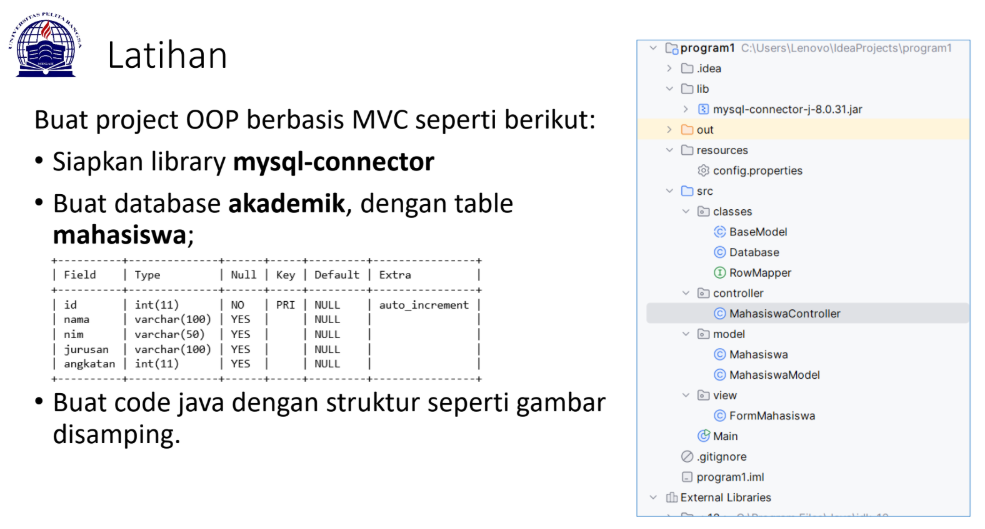

### STRUKTUR PROYEK

**- Proyek ini menggunakan arsitektur MVC (Model-View-Controller) dengan struktur folder:**

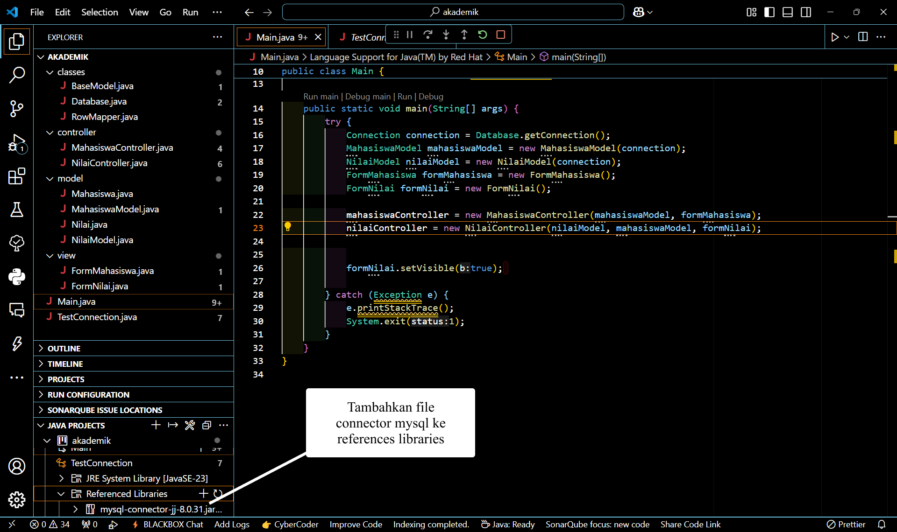

**- classes:** Berisi kelas-kelas dasar dan utilitas

**- controller:** Berisi logic untuk mengontrol alur data

**- model:** Berisi struktur data dan operasi database

**- view:** Berisi tampilan GUI

**- Main.java:** File utama untuk menjalankan aplikasi


## PENJELASAN SETIAP PACKAGE DAN FILE

### A. Package Classes:

#### BaseModel.java

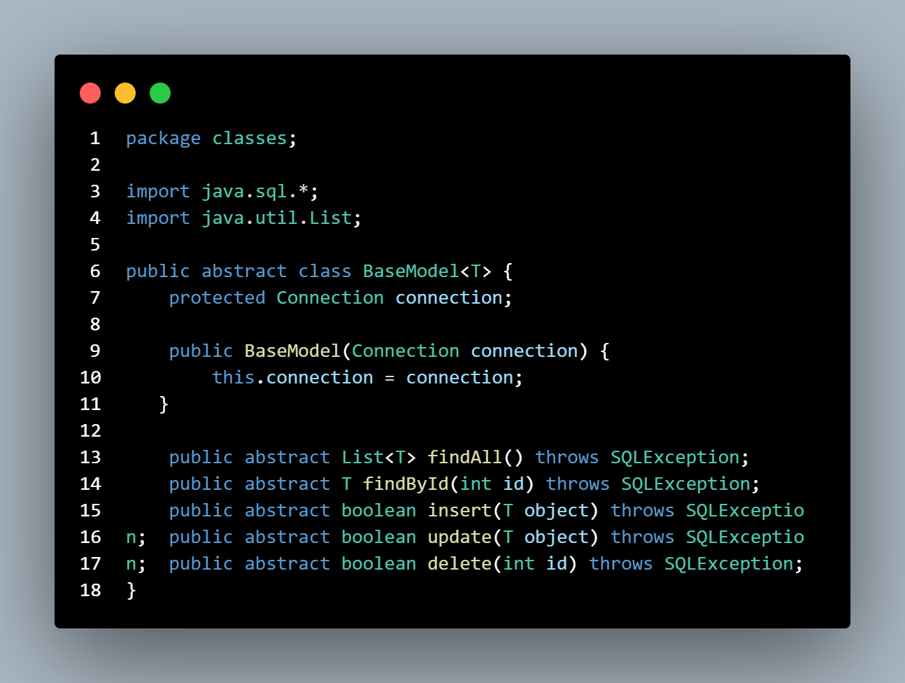

- Merupakan abstract class yang menjadi dasar untuk semua model
Mengimplementasikan operasi CRUD dasar (Create, Read, Update, Delete)
Menggunakan generic type <T> untuk fleksibilitas tipe data
Method abstract yang harus diimplementasikan:

**1. findAll():** Mengambil semua data

**2. findById():** Mencari data berdasarkan ID

**3. insert():** Menambah data baru

**4. update():** Mengubah data

**5. delete():** Menghapus data


#### Database.java

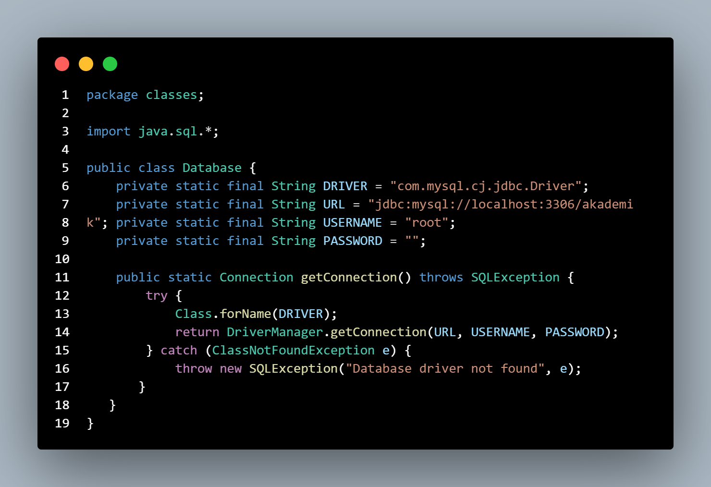

- Mengatur koneksi ke database MySQL
Menggunakan pattern Singleton untuk koneksi database
Menyimpan konfigurasi database seperti:

**1. DRIVER:** MySQL JDBC driver

**2. URL:** Alamat database

**3. USERNAME:** Username MySQL

**4. PASSWORD:** Password MySQL


#### RowMapper.java


- Interface untuk mapping data dari ResultSet ke objek

**1. Memudahkan konversi data dari database ke objek Java**

**2. Menggunakan generic type untuk fleksibilitas**

### B. Package Controller:

#### MahasiswaController.java

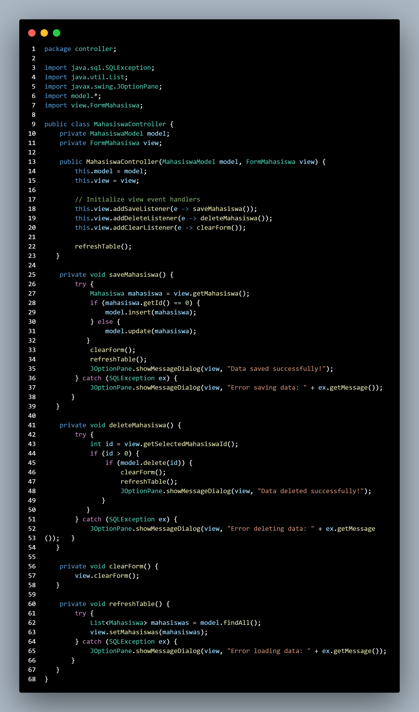

- Menghubungkan Model dan View
Menghandle event dari View
Implementasi logika bisnis seperti:

**1. saveMahasiswa():** Menyimpan/update data mahasiswa

**2. deleteMahasiswa():** Menghapus data mahasiswa

**3. clearForm():** Membersihkan form

**4. refreshTable():** Memperbarui tampilan tabel

#### NilaiController.java

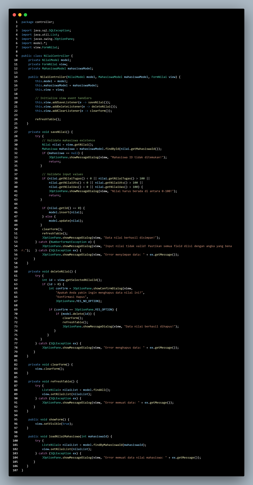

- Mengontrol operasi CRUD untuk data nilai mahasiswa.

**Fungsi utama:**

**1. Simpan Nilai:** Memvalidasi data nilai sebelum menyimpan ke database (termasuk memastikan ID mahasiswa valid dan nilai dalam rentang 0-100).

**2. Hapus Nilai:** Menghapus data nilai berdasarkan id.

**3. Refresh Tabel:** Memuat ulang data nilai ke tabel di antarmuka pengguna.

### C. Package Model:

#### Mahasiswa.java

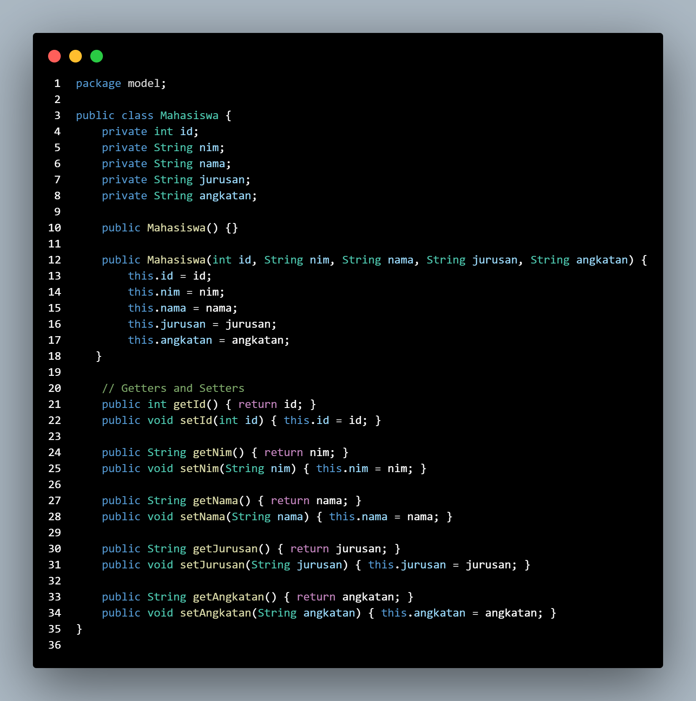

- POJO (Plain Old Java Object) untuk data mahasiswa
Memiliki properti:

**1. id:** ID mahasiswa

**2. nim:** Nomor Induk Mahasiswa

**3. nama:** Nama mahasiswa

**4. jurusan:** Jurusan mahasiswa

**5. angkatan:** Angkatan Tahun mahasiswa


- Dilengkapi dengan getter dan setter


#### MahasiswaModel.java

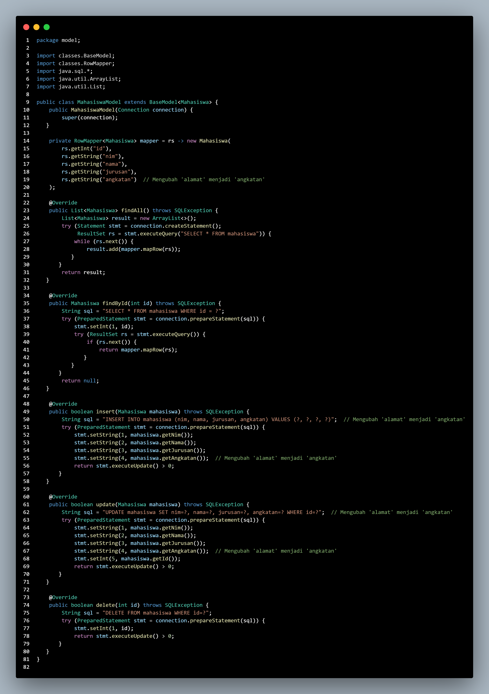

- Extends BaseModel<Mahasiswa>
Implementasi operasi database untuk entity Mahasiswa
Menggunakan PreparedStatement untuk keamanan dari SQL Injection
Implementasi method CRUD:

**1. findAll():** SELECT semua mahasiswa

**2. findById():** SELECT mahasiswa berdasar ID

**3. insert():** INSERT mahasiswa baru

**4. update():** UPDATE data mahasiswa

**5. delete():** DELETE mahasiswa

#### Nilai.java

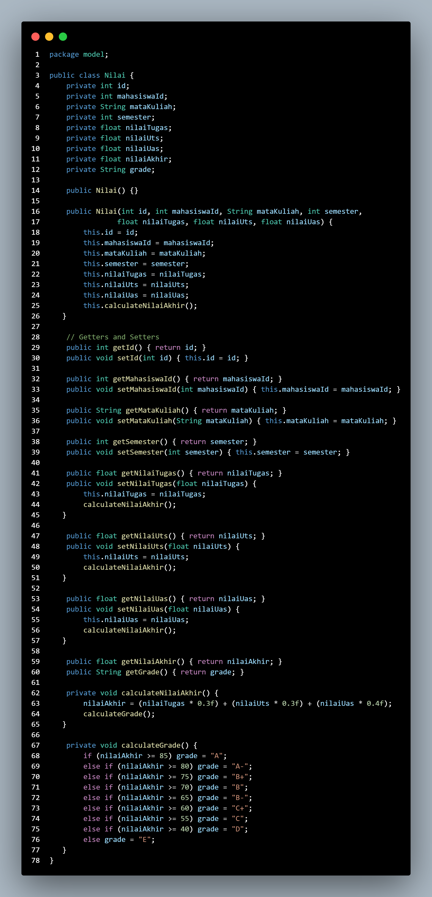

- Atribut Kelas

**id**

Tipe: **int**

-Digunakan untuk menyimpan primary key dari tabel nilai. Atribut ini berfungsi sebagai identitas unik untuk setiap data nilai mahasiswa.

**mahasiswaId**

Tipe: **int**

- Menyimpan referensi ke mahasiswa yang bersangkutan. Atribut ini mengacu pada ID mahasiswa di tabel mahasiswa (foreign key).

**mataKuliah**

Tipe: **String**

- Menyimpan nama mata kuliah yang diambil oleh mahasiswa.

**semester**

Tipe: **int**

- Menunjukkan semester di mana mata kuliah tersebut diambil.

**nilaiTugas**

Tipe: **float**

- Menyimpan nilai tugas mahasiswa untuk mata kuliah tertentu.

**nilaiUts**

Tipe: **float**

- Menyimpan nilai UTS (Ujian Tengah Semester) mahasiswa.

**nilaiUas**

Tipe: **float**

- Menyimpan nilai UAS (Ujian Akhir Semester) mahasiswa.

**nilaiAkhir (dihitung)**

Tipe: **float**

- Merupakan nilai akhir yang dihitung berdasarkan bobot dari nilai tugas, UTS, dan UAS. Biasanya, perhitungan dilakukan dengan rumus tertentu, misalnya:
```
nilaiAkhir = (0.3 * nilaiTugas) + (0.3 * nilaiUts) + (0.4 * nilaiUas);
```
-Nilai ini hanya digunakan untuk membaca hasil akhir dan tidak dimasukkan langsung oleh pengguna.

**grade (dihitung)**

Tipe: **String**

- Menyimpan grade berdasarkan nilai akhir, misalnya:
```
A: >= 80
B: 70 - 79
C: 60 - 69
D: 50 - 59
E: < 50
```
- Grade ini digunakan untuk mengevaluasi performa mahasiswa dalam suatu mata kuliah.

#### NilaiModel.java


- Kelas ini adalah model data untuk entitas Nilai dan mengatur semua operasi yang berhubungan dengan database, seperti CRUD (Create, Read, Update, Delete).

- Terhubung dengan tabel database nilai.


**Fitur utama:**

**findAll:** Mengambil semua data dari tabel nilai.
**findByMahasiswaId:** Mengambil data berdasarkan mahasiswa_id.
**findById:** Mengambil data berdasarkan id.
**insert:** Menyisipkan data baru ke tabel nilai.
**update:** Memperbarui data yang sudah ada di tabel.
**delete:** Menghapus data dari tabel berdasarkan id.

- Data dari tabel diambil menggunakan ResultSet dan diubah menjadi objek Nilai menggunakan RowMapper.
Semua query ditulis menggunakan PreparedStatement untuk menghindari SQL Injection.


### D. Package View:

#### FormMahasiswa.java

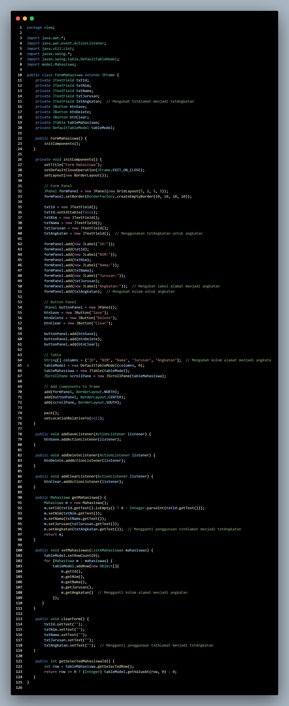

- Implementasi GUI menggunakan Java Swing
Komponen utama:

**1. JTextField** untuk input data

**2. JButton** untuk aksi (Save, Delete, Clear)

**3. JTable** untuk menampilkan data


**- Fitur:**

**1.** Form input data mahasiswa

**2.** Tabel daftar mahasiswa

**3.** Tombol aksi


Event handling untuk interaksi user

#### FormNilai.java


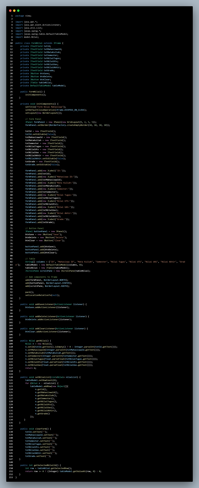

**Penjelasan**

- GUI untuk menampilkan data Nilai dari mahasiswa.

- Digunakan untuk memasukkan nilai tugas, UTS, UAS, dan menghitung nilai akhir serta grade.

**Fitur utama:**

**Input field:**

**ID:** Identitas nilai (readonly).

**Mahasiswa ID:** ID mahasiswa terkait.

**Mata Kuliah, Semester, Nilai Tugas, Nilai UTS, Nilai UAS:** Informasi nilai yang dapat dimasukkan.

**Nilai Akhir dan Grade:** Dihitung otomatis berdasarkan nilai-nilai yang dimasukkan.

- Tombol:

**Save:** Menyimpan data ke database.

**Delete:** Menghapus data nilai yang dipilih.

**Clear:** Membersihkan input field.

- Tabel:

**Menampilkan daftar nilai mahasiswa.**


- Ketika pengguna memasukkan nilai, aplikasi akan otomatis menghitung Nilai Akhir dan Grade berdasarkan logika di controller.
Setelah menyimpan data, tabel akan diperbarui dengan data terbaru.

### E. Main.java

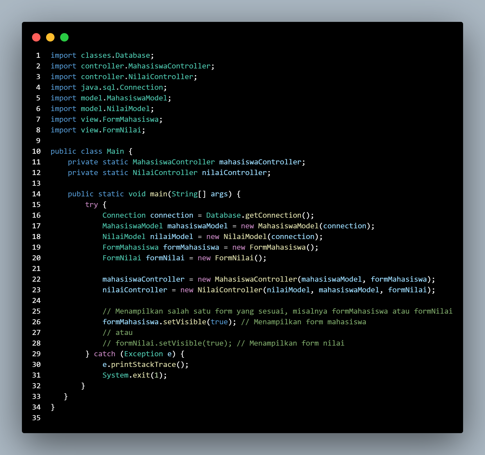

- Kelas utama yang mengatur koneksi ke database dan menghubungkan semua komponen (model, view, controller).

**Fungsi utama:**

- Membuat objek:

**Connection:** Koneksi ke database melalui Database.getConnection().

**MahasiswaModel:** Model untuk entitas Mahasiswa.

**NilaiModel:** Model untuk entitas Nilai.

**FormMahasiswa:** GUI untuk mahasiswa.

**FormNilai:** GUI untuk nilai mahasiswa.

- Menghubungkan:

**MahasiswaController** dengan **MahasiswaModel** dan **FormMahasiswa**.

**NilaiController** dengan **NilaiModel**, **MahasiswaModel**, dan **FormNilai**.


- Menampilkan GUI FormNilai kepada pengguna.


### KONFIGURASI DATABASE DI MYSQL

**- #mysql -h127.0.0.1 -uroot**

```
CREATE DATABASE akademik;
```
```
USE akademik;
```
```
CREATE TABLE mahasiswa (
    id INT PRIMARY KEY AUTO_INCREMENT,
    nim VARCHAR(20) NOT NULL UNIQUE,
    nama VARCHAR(100) NOT NULL,
    jurusan VARCHAR(50) NOT NULL,
    angkatan VARCHAR(100) NOT NULL
);
```
```
CREATE TABLE nilai (
    id INT PRIMARY KEY AUTO_INCREMENT,
    mahasiswa_id INT NOT NULL,
    mata_kuliah VARCHAR(100) NOT NULL,
    semester INT NOT NULL,
    nilai_tugas FLOAT,
    nilai_uts FLOAT,
    nilai_uas FLOAT,
    nilai_akhir FLOAT,
    grade CHAR(2),
    FOREIGN KEY (mahasiswa_id) REFERENCES mahasiswa(id)
    ON DELETE CASCADE
);
```


### Output

#### Form Mahasiswa

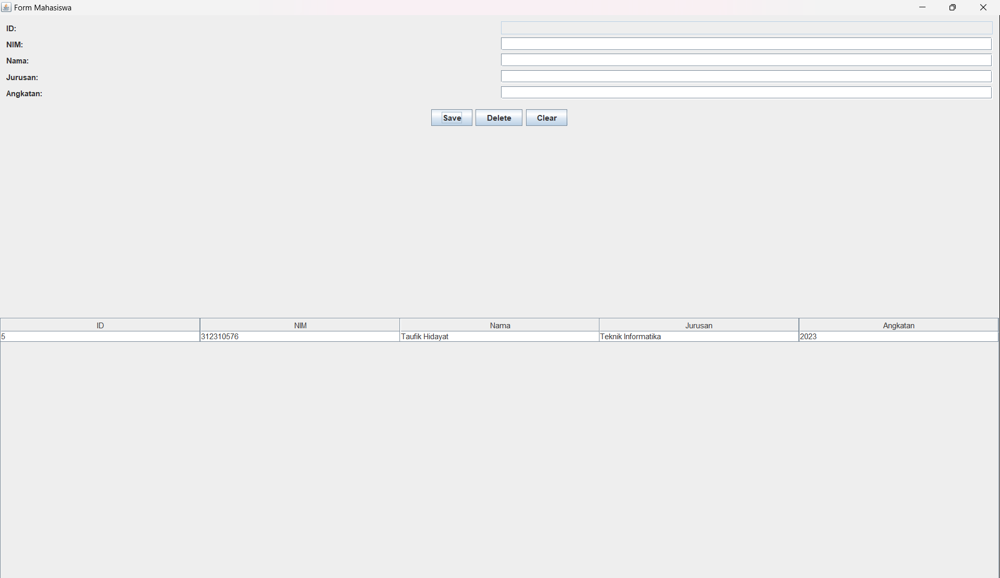

#### Form Nilai Mahasiswa

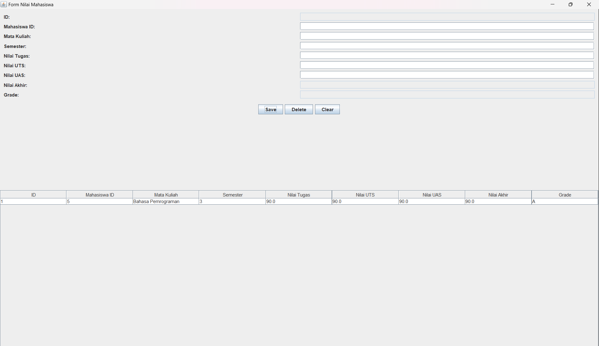

## Selesai
