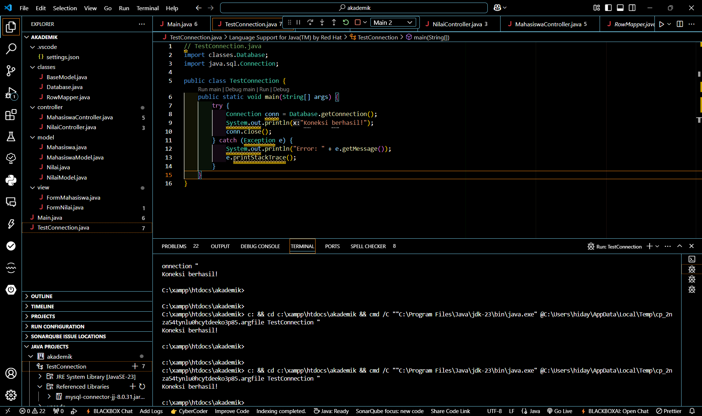

## Event Listener
| Pertemuan 13  |  Pemrograman Berorientasi Objek  
|-------|---------
| NIM   | 312310576
| Nama  | Taufik Hidayat
| Kelas | TI.23.A6


## Latihan OOP


### STRUKTUR PROYEK

**- Proyek ini menggunakan arsitektur MVC (Model-View-Controller) dengan struktur folder:**



**- classes:** Berisi kelas-kelas dasar dan utilitas

**- controller:** Berisi logic untuk mengontrol alur data

**- model:** Berisi struktur data dan operasi database

**- view:** Berisi tampilan GUI

**- Main.java:** File utama untuk menjalankan aplikasi

### KONFIGURASI DATABASE DI MYSQL

**- #mysql -h127.0.0.1 -uroot**

```
CREATE DATABASE akademik;
```
```
USE akademik;
```
```
CREATE TABLE mahasiswa (
    id INT PRIMARY KEY AUTO_INCREMENT,
    nim VARCHAR(20) NOT NULL UNIQUE,
    nama VARCHAR(100) NOT NULL,
    jurusan VARCHAR(50) NOT NULL,
    angkatan VARCHAR(100) NOT NULL
);
```
```
CREATE TABLE nilai (
    id INT PRIMARY KEY AUTO_INCREMENT,
    mahasiswa_id INT NOT NULL,
    mata_kuliah VARCHAR(100) NOT NULL,
    semester INT NOT NULL,
    nilai CHAR(2),
    FOREIGN KEY (mahasiswa_id) REFERENCES mahasiswa(id)
    ON DELETE CASCADE
);
```

## PENJELASAN SETIAP PACKAGE DAN FILE

### A. Package Classes:

#### BaseModel.java

