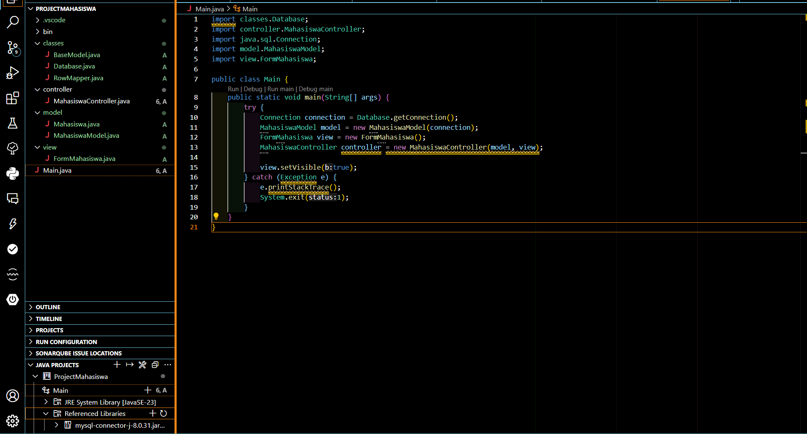
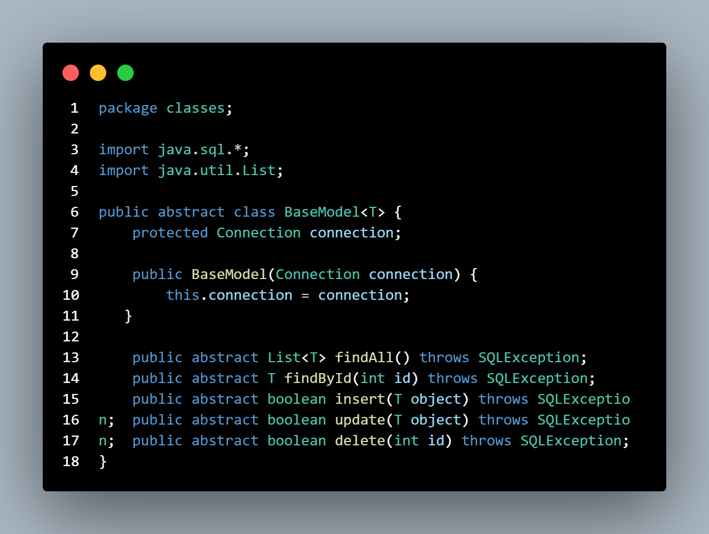
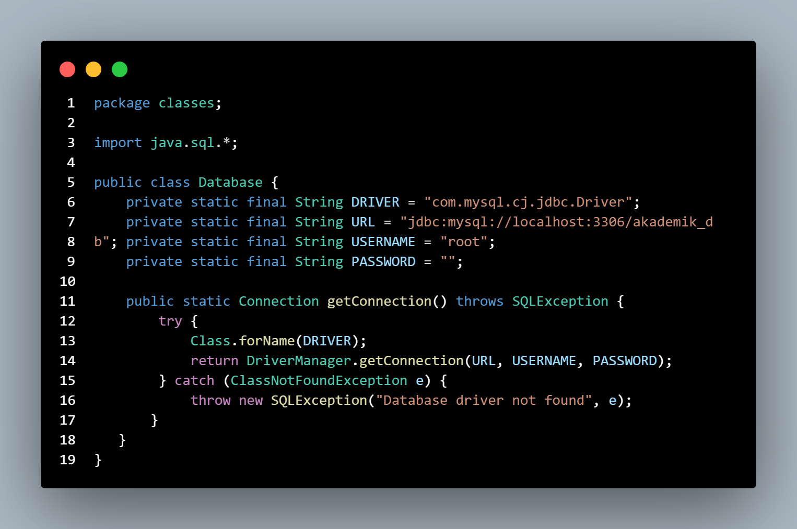
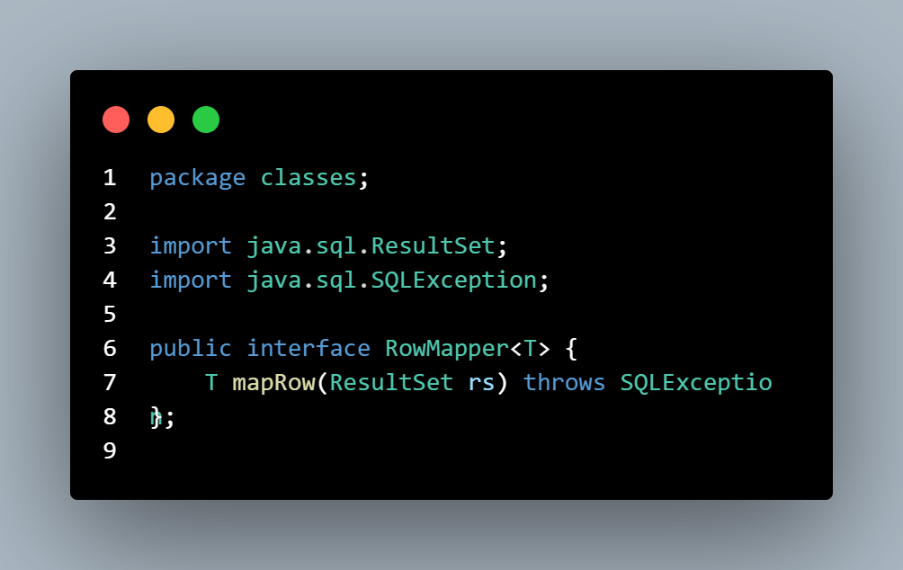
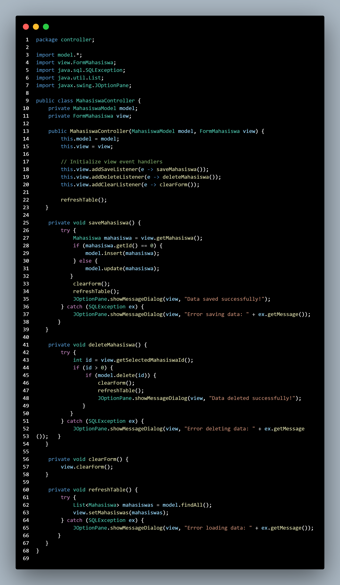
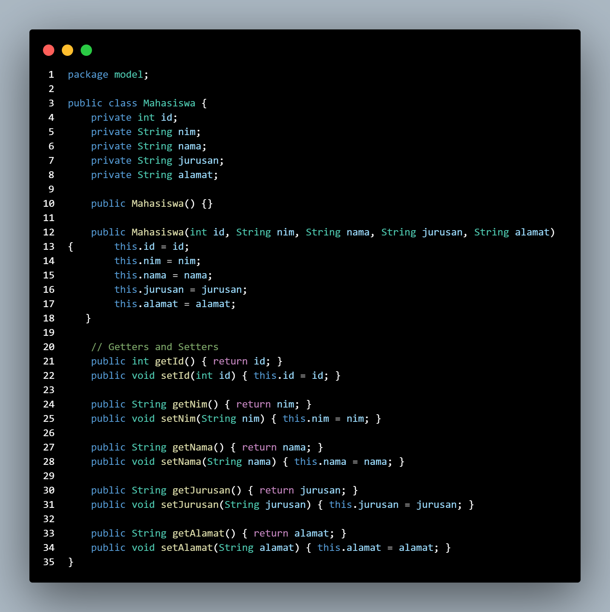
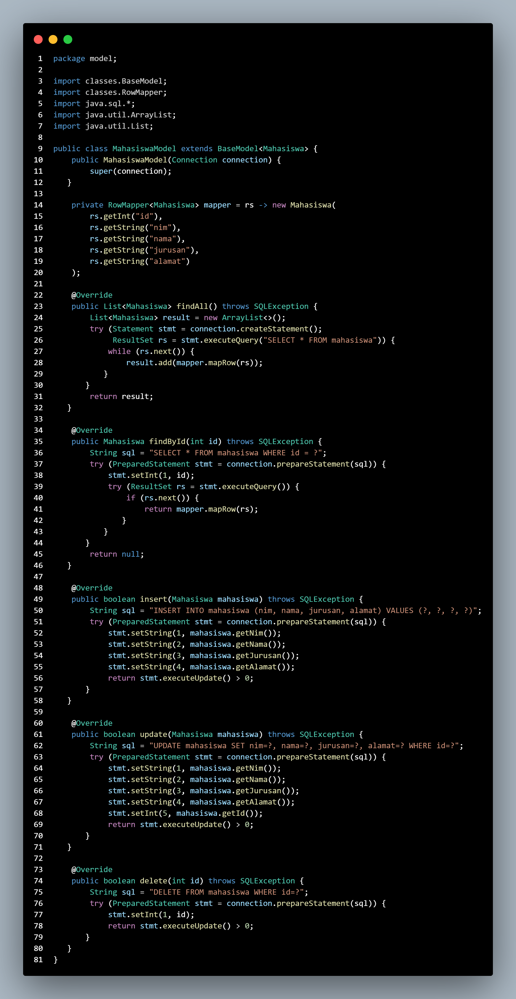
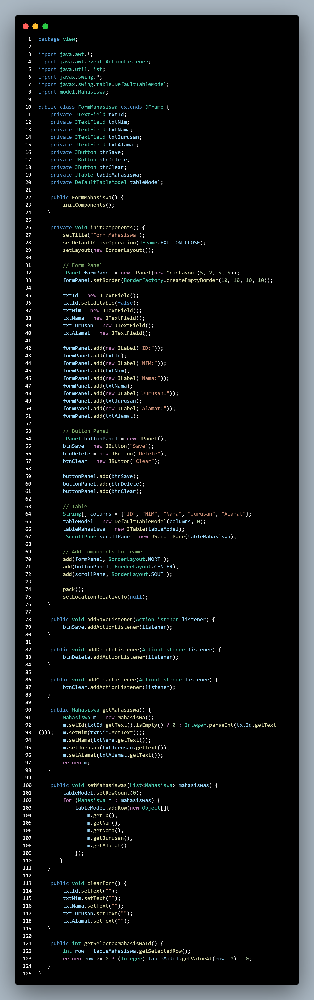
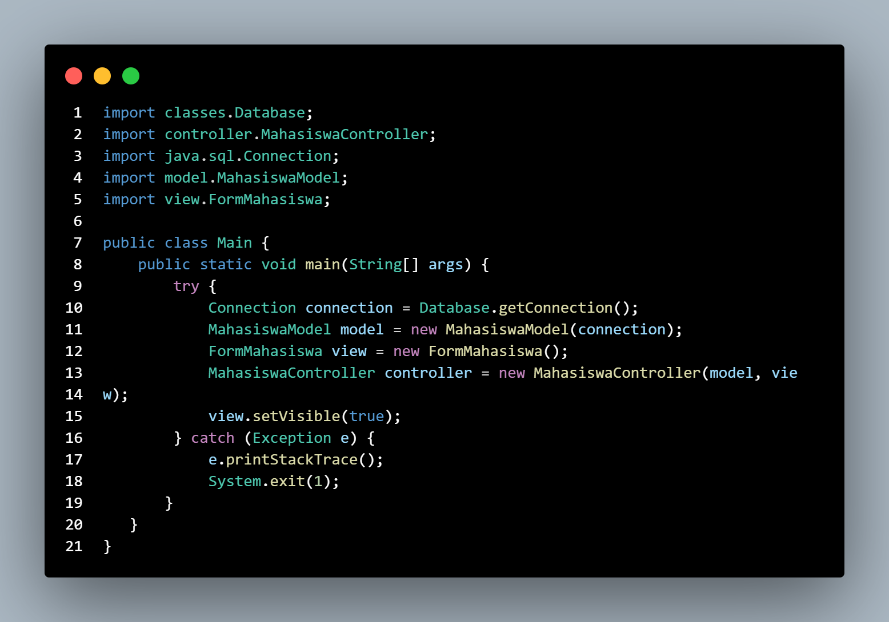
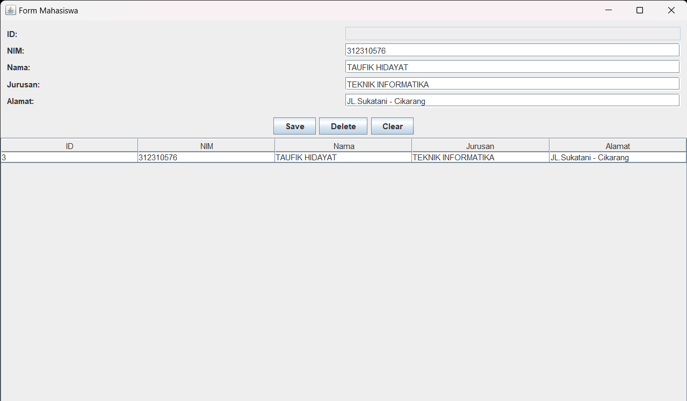

## Event Listener
| Pertemuan 13  |  Pemrograman Berorientasi Objek  
|-------|---------
| NIM   | 312310576
| Nama  | Taufik Hidayat
| Kelas | TI.23.A6


## Latihan OOP


### STRUKTUR PROYEK

- Proyek ini menggunakan arsitektur MVC (Model-View-Controller) dengan struktur folder:



- classes: Berisi kelas-kelas dasar dan utilitas

- controller: Berisi logic untuk mengontrol alur data

- model: Berisi struktur data dan operasi database

- view: Berisi tampilan GUI

- Main.java: File utama untuk menjalankan aplikasi


## PENJELASAN SETIAP PACKAGE DAN FILE

### A. Package Classes:

#### BaseModel.java



- Merupakan abstract class yang menjadi dasar untuk semua model
Mengimplementasikan operasi CRUD dasar (Create, Read, Update, Delete)
Menggunakan generic type <T> untuk fleksibilitas tipe data
Method abstract yang harus diimplementasikan:

1. findAll(): Mengambil semua data

2. findById(): Mencari data berdasarkan ID

3. insert(): Menambah data baru

4. update(): Mengubah data

5. delete(): Menghapus data


#### Database.java



- Mengatur koneksi ke database MySQL
Menggunakan pattern Singleton untuk koneksi database
Menyimpan konfigurasi database seperti:

1. DRIVER: MySQL JDBC driver

2. URL: Alamat database

3. USERNAME: Username MySQL

4. PASSWORD: Password MySQL


#### RowMapper.java



- Interface untuk mapping data dari ResultSet ke objek

1. Memudahkan konversi data dari database ke objek Java

2. Menggunakan generic type untuk fleksibilitas

### B. Package Controller:

#### MahasiswaController.java



- Menghubungkan Model dan View
Menghandle event dari View
Implementasi logika bisnis seperti:

1. saveMahasiswa(): Menyimpan/update data mahasiswa

2. deleteMahasiswa(): Menghapus data mahasiswa

3. clearForm(): Membersihkan form

4. refreshTable(): Memperbarui tampilan tabel


### C. Package Model:

#### Mahasiswa.java



- POJO (Plain Old Java Object) untuk data mahasiswa
Memiliki properti:

1. id: ID mahasiswa

2. nim: Nomor Induk Mahasiswa

3. nama: Nama mahasiswa

4. jurusan: Jurusan mahasiswa

5. alamat: Alamat mahasiswa


Dilengkapi dengan getter dan setter


#### MahasiswaModel.java



- Extends BaseModel<Mahasiswa>
Implementasi operasi database untuk entity Mahasiswa
Menggunakan PreparedStatement untuk keamanan dari SQL Injection
Implementasi method CRUD:

1. findAll(): SELECT semua mahasiswa

2. findById(): SELECT mahasiswa berdasar ID

3. insert(): INSERT mahasiswa baru

4. update(): UPDATE data mahasiswa

5. delete(): DELETE mahasiswa


### D. Package View:

#### FormMahasiswa.java



- Implementasi GUI menggunakan Java Swing
Komponen utama:

1. JTextField untuk input data

2. JButton untuk aksi (Save, Delete, Clear)

3. JTable untuk menampilkan data


- Fitur:

1. Form input data mahasiswa

2. Tabel daftar mahasiswa

3. Tombol aksi


Event handling untuk interaksi user

### E. Main.java



- Entry point aplikasi
Inisialisasi semua komponen:

1. Membuat koneksi database

2. Membuat instance Model

3. Membuat instance View

4. Membuat instance Controller

5. Menampilkan GUI


### KONFIGURASI DATABASE DI MYSQL

- #mysql -h127.0.0.1 -uroot

```
CREATE DATABASE akademik_db;
```
```
USE akademik_db;
```
```
CREATE TABLE mahasiswa (
    id INT PRIMARY KEY AUTO_INCREMENT,
    nim VARCHAR(20) NOT NULL UNIQUE,
    nama VARCHAR(100) NOT NULL,
    jurusan VARCHAR(50) NOT NULL,
    alamat TEXT
);
```

### CARA PENGGUNAAN APLIKASI

#### A. Persiapan:

- Install MySQL

- Buat database menggunakan script SQL di atas

- Install MySQL JDBC Driver

- Sesuaikan konfigurasi database di Database.java

#### B. Menjalankan Aplikasi:

- Compile semua file Java

- Jalankan Main.java

- GUI aplikasi akan muncul

#### C. Fitur-fitur:

- Tambah Mahasiswa:

1. Isi form dengan data mahasiswa

2. Klik tombol Save


- Edit Mahasiswa:

1. Pilih data di tabel

2. Data akan muncul di form

3. Ubah data

4. Klik Save

- Hapus Mahasiswa:

1. Pilih data di tabel

2. Klik Delete


- Clear Form:

1. Klik Clear untuk membersihkan form

### Output



## Selesai
