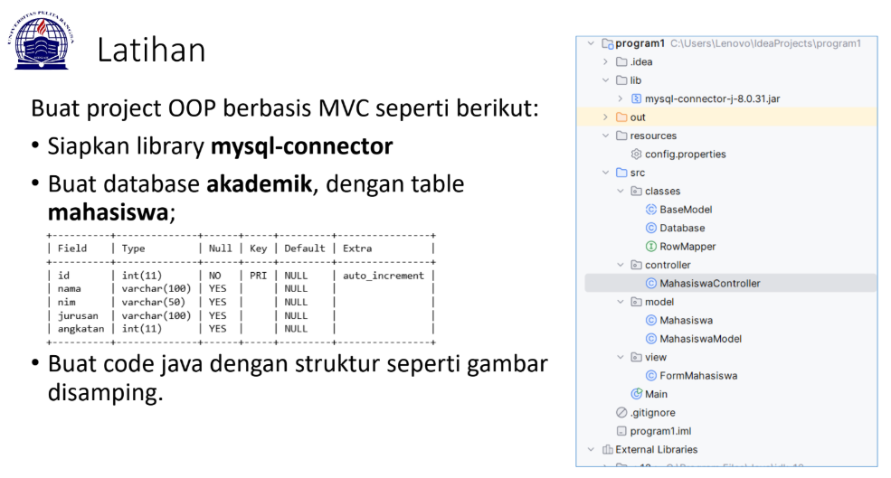
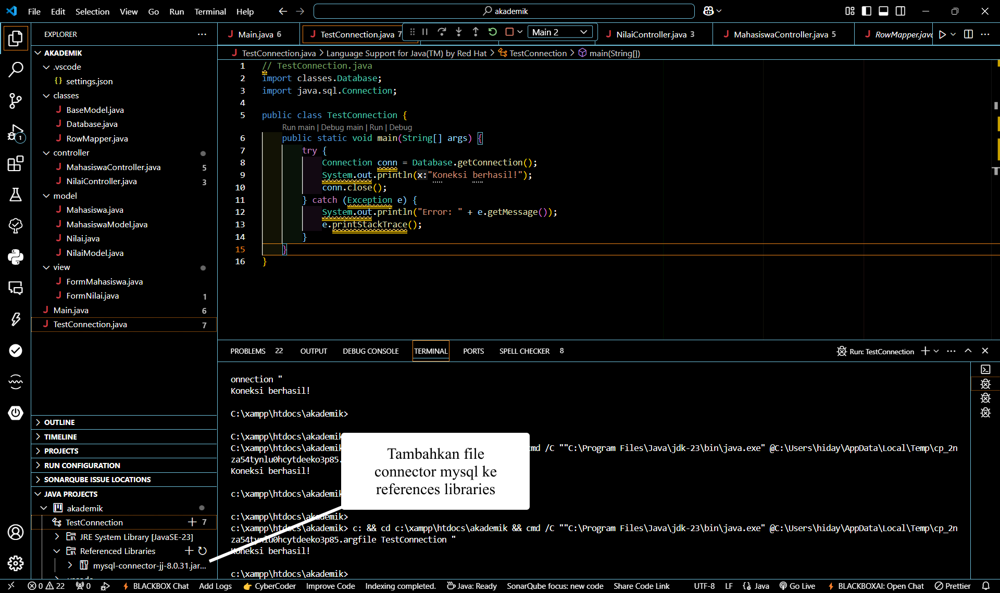
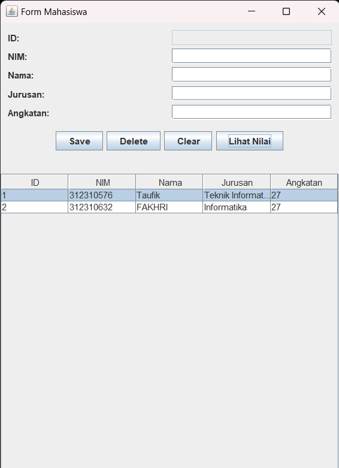
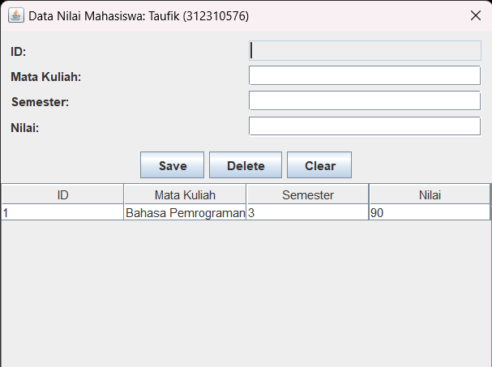

## Event Listener
| Pertemuan 13  |  Pemrograman Berorientasi Objek  
|-------|---------
| NIM   | 312310576
| Nama  | Taufik Hidayat
| Kelas | TI.23.A6


## Latihan OOP


### STRUKTUR PROYEK

**- Proyek ini menggunakan arsitektur MVC (Model-View-Controller) dengan struktur folder:**



**- classes:** Berisi kelas-kelas dasar dan utilitas

**- controller:** Berisi logic untuk mengontrol alur data

**- model:** Berisi struktur data dan operasi database

**- view:** Berisi tampilan GUI

**- Main.java:** File utama untuk menjalankan aplikasi

### KONFIGURASI DATABASE DI MYSQL

**- #mysql -h127.0.0.1 -uroot**

```
CREATE DATABASE akademik;
```
```
USE akademik;
```
```
CREATE TABLE mahasiswa (
    id INT PRIMARY KEY AUTO_INCREMENT,
    nim VARCHAR(20) NOT NULL UNIQUE,
    nama VARCHAR(100) NOT NULL,
    jurusan VARCHAR(50) NOT NULL,
    angkatan VARCHAR(100) NOT NULL
);
```
```
CREATE TABLE nilai (
    id INT PRIMARY KEY AUTO_INCREMENT,
    mahasiswa_id INT NOT NULL,
    mata_kuliah VARCHAR(100) NOT NULL,
    semester INT NOT NULL,
    nilai CHAR(2),
    FOREIGN KEY (mahasiswa_id) REFERENCES mahasiswa(id)
    ON DELETE CASCADE
);
```

## PENJELASAN SETIAP PACKAGE DAN FILE

### Package Classes:

#### BaseModel.java

```
package classes;

import java.sql.*;
import java.util.List;

public abstract class BaseModel<T> {
    protected Connection connection;
    
    public BaseModel(Connection connection) {
        this.connection = connection;
    }
    
    public abstract List<T> findAll() throws SQLException;
    public abstract T findById(int id) throws SQLException;
    public abstract boolean insert(T object) throws SQLException;
    public abstract boolean update(T object) throws SQLException;
    public abstract boolean delete(int id) throws SQLException;
}
```

Ini adalah abstract class yang berfungsi sebagai base/template untuk model-model lainnya

Menggunakan generic type <T> sehingga bisa digunakan untuk berbagai jenis model

Memiliki koneksi database sebagai protected field

Mendefinisikan method-method dasar CRUD yang wajib diimplementasikan oleh child class:

- **findAll()**: mengambil semua data

- **findById()**: mencari data berdasarkan ID

- **insert()**: menambah data baru

- **update()**: mengupdate data yang ada

- **delete()**: menghapus data

####  Database.java

```
package classes;

import java.sql.*;

public class Database {
    private static final String DRIVER = "com.mysql.cj.jdbc.Driver";
    private static final String URL = "jdbc:mysql://localhost:3306/akademik";
    private static final String USERNAME = "root";
    private static final String PASSWORD = "";
    
    public static Connection getConnection() throws SQLException {
        try {
            Class.forName(DRIVER);
            return DriverManager.getConnection(URL, USERNAME, PASSWORD);
        } catch (ClassNotFoundException e) {
            throw new SQLException("Database driver not found", e);
        }
    }
}
```
Class utility untuk mengelola koneksi database

Menyimpan konstanta konfigurasi database seperti driver, URL, username dan password

Memiliki method static getConnection() yang mengembalikan object Connection

Menggunakan MySQL sebagai database dengan nama database "akademik"

Menangani error jika driver database tidak ditemukan

### RowMapper.java

```
package classes;

import java.sql.ResultSet;
import java.sql.SQLException;

public interface RowMapper<T> {
    T mapRow(ResultSet rs) throws SQLException;
}
```

Interface dengan generic type <T>

Bertugas memetakan hasil query (ResultSet) ke object model

Memiliki satu method mapRow() yang harus diimplementasikan

Membantu memisahkan logic pemetaan data dari model

### Package Controller

#### MahasisaController.java
```
package controller;

import java.sql.Connection;
import java.sql.SQLException;
import java.util.List;
import javax.swing.JOptionPane;
import model.*;
import view.FormMahasiswa;
import view.FormNilai;

public class MahasiswaController {
    private MahasiswaModel model;
    private FormMahasiswa view;
    private Connection connection;
    
    public MahasiswaController(MahasiswaModel model, FormMahasiswa view, Connection connection) {
        this.model = model;
        this.view = view;
        this.connection = connection;
        
        // Initialize view event handlers
        this.view.addSaveListener(e -> saveMahasiswa());
        this.view.addDeleteListener(e -> deleteMahasiswa());
        this.view.addClearListener(e -> clearForm());
        this.view.addNilaiListener(e -> showNilai());
        
        refreshTable();
    }
    
    private void saveMahasiswa() {
        try {
            Mahasiswa mahasiswa = view.getMahasiswa();
            if (mahasiswa.getId() == 0) {
                model.insert(mahasiswa);
            } else {
                model.update(mahasiswa);
            }
            clearForm();
            refreshTable();
            JOptionPane.showMessageDialog(view, "Data saved successfully!");
        } catch (SQLException ex) {
            JOptionPane.showMessageDialog(view, "Error saving data: " + ex.getMessage());
        }
    }
    
    private void deleteMahasiswa() {
        try {
            int id = view.getSelectedMahasiswaId();
            if (id > 0) {
                if (model.delete(id)) {
                    clearForm();
                    refreshTable();
                    JOptionPane.showMessageDialog(view, "Data deleted successfully!");
                }
            }
        } catch (SQLException ex) {
            JOptionPane.showMessageDialog(view, "Error deleting data: " + ex.getMessage());
        }
    }
    
    private void clearForm() {
        view.clearForm();
    }
    
    private void refreshTable() {
        try {
            List<Mahasiswa> mahasiswas = model.findAll();
            view.setMahasiswas(mahasiswas);
        } catch (SQLException ex) {
            JOptionPane.showMessageDialog(view, "Error loading data: " + ex.getMessage());
        }
    }

    private void showNilai() {
        try {
            int mahasiswaId = view.getSelectedMahasiswaId();
            if (mahasiswaId > 0) {
                // Get the selected Mahasiswa data
                Mahasiswa selectedMahasiswa = model.findById(mahasiswaId);
                if (selectedMahasiswa != null) {
                    // Create FormNilai with parent frame
                    FormNilai nilaiForm = new FormNilai(view);
                    // Set mahasiswa info after creation
                    nilaiForm.setMahasiswaInfo(selectedMahasiswa);
                    
                    NilaiModel nilaiModel = new NilaiModel(connection);
                    NilaiController nilaiController = new NilaiController(nilaiModel, nilaiForm, mahasiswaId);
                    nilaiForm.setVisible(true);
                } else {
                    JOptionPane.showMessageDialog(view, 
                        "Error: Selected student data not found!", 
                        "Error", 
                        JOptionPane.ERROR_MESSAGE);
                }
            } else {
                JOptionPane.showMessageDialog(view, 
                    "Please select a student first!", 
                    "Warning", 
                    JOptionPane.WARNING_MESSAGE);
            }
        } catch (SQLException ex) {
            JOptionPane.showMessageDialog(view, 
                "Database error: " + ex.getMessage(), 
                "Error", 
                JOptionPane.ERROR_MESSAGE);
        }
    }
}
```
Mengontrol interaksi antara MahasiswaModel dan FormMahasiswa view

Menginisialisasi event handler untuk tombol-tombol di form

Memiliki method untuk:

- **saveMahasiswa()**: menyimpan/update data mahasiswa

- **deleteMahasiswa()**: menghapus data mahasiswa

- **clearForm()**: membersihkan form

- **refreshTable()**: memperbarui tampilan tabel

- **showNilai()**: menampilkan form nilai mahasiswa

#### NilaiController.java
```
package controller;

import java.sql.SQLException;
import java.util.List;
import javax.swing.JOptionPane;
import model.*;
import view.FormNilai;

public class NilaiController {
    private NilaiModel model;
    private FormNilai view;
    private int mahasiswaId;
    
    public NilaiController(NilaiModel model, FormNilai view, int mahasiswaId) {
        this.model = model;
        this.view = view;
        this.mahasiswaId = mahasiswaId;
        
        // Initialize view event handlers
        this.view.addSaveListener(e -> saveNilai());
        this.view.addDeleteListener(e -> deleteNilai());
        this.view.addClearListener(e -> clearForm());
        
        refreshTable();
    }
    
    private void saveNilai() {
        try {
            // Get nilai from form and set mahasiswaId
            Nilai nilai = view.getNilai();
            nilai.setMahasiswaId(mahasiswaId);
            
            // Validate Mata Kuliah
            if (nilai.getMataKuliah() == null || nilai.getMataKuliah().trim().isEmpty()) {
                JOptionPane.showMessageDialog(view, 
                    "Mata Kuliah tidak boleh kosong!", 
                    "Validasi Error", 
                    JOptionPane.WARNING_MESSAGE);
                return;
            }
            
            // Validate Semester
            if (nilai.getSemester() == null || nilai.getSemester().trim().isEmpty()) {
                JOptionPane.showMessageDialog(view, 
                    "Semester tidak boleh kosong!", 
                    "Validasi Error", 
                    JOptionPane.WARNING_MESSAGE);
                return;
            }
            
            // Validate Nilai
            if (nilai.getNilai() < 0 || nilai.getNilai() > 100) {
                JOptionPane.showMessageDialog(view, 
                    "Nilai harus antara 0-100!", 
                    "Validasi Error", 
                    JOptionPane.WARNING_MESSAGE);
                return;
            }

            // Check if this is a new record or update
            if (nilai.getId() == 0) {
                // New record
                if (model.insert(nilai)) {
                    JOptionPane.showMessageDialog(view, 
                        "Nilai berhasil disimpan!", 
                        "Sukses", 
                        JOptionPane.INFORMATION_MESSAGE);
                    clearForm();
                    refreshTable();
                } else {
                    JOptionPane.showMessageDialog(view, 
                        "Gagal menyimpan nilai!", 
                        "Error", 
                        JOptionPane.ERROR_MESSAGE);
                }
            } else {
                // Update existing record
                int confirm = JOptionPane.showConfirmDialog(view,
                    "Apakah Anda yakin ingin mengupdate nilai ini?",
                    "Konfirmasi Update",
                    JOptionPane.YES_NO_OPTION);
                    
                if (confirm == JOptionPane.YES_OPTION) {
                    if (model.update(nilai)) {
                        JOptionPane.showMessageDialog(view, 
                            "Nilai berhasil diupdate!", 
                            "Sukses", 
                            JOptionPane.INFORMATION_MESSAGE);
                        clearForm();
                        refreshTable();
                    } else {
                        JOptionPane.showMessageDialog(view, 
                            "Gagal mengupdate nilai!", 
                            "Error", 
                            JOptionPane.ERROR_MESSAGE);
                    }
                }
            }
        } catch (Exception ex) {
            JOptionPane.showMessageDialog(view, 
                "Error: " + ex.getMessage(), 
                "Error", 
                JOptionPane.ERROR_MESSAGE);
        }
    }
    
    private void deleteNilai() {
        try {
            int id = view.getSelectedNilaiId();
            if (id > 0) {
                int confirm = JOptionPane.showConfirmDialog(view,
                    "Apakah Anda yakin ingin menghapus nilai ini?",
                    "Konfirmasi Hapus",
                    JOptionPane.YES_NO_OPTION);
                    
                if (confirm == JOptionPane.YES_OPTION) {
                    if (model.delete(id)) {
                        JOptionPane.showMessageDialog(view, 
                            "Nilai berhasil dihapus!", 
                            "Sukses", 
                            JOptionPane.INFORMATION_MESSAGE);
                        clearForm();
                        refreshTable();
                    } else {
                        JOptionPane.showMessageDialog(view, 
                            "Gagal menghapus nilai!", 
                            "Error", 
                            JOptionPane.ERROR_MESSAGE);
                    }
                }
            } else {
                JOptionPane.showMessageDialog(view, 
                    "Pilih nilai yang akan dihapus!", 
                    "Peringatan", 
                    JOptionPane.WARNING_MESSAGE);
            }
        } catch (SQLException ex) {
            JOptionPane.showMessageDialog(view, 
                "Error database: " + ex.getMessage(), 
                "Error", 
                JOptionPane.ERROR_MESSAGE);
        }
    }
    
    private void clearForm() {
        view.clearForm();
    }
    
    private void refreshTable() {
        try {
            List<Nilai> nilaiList = model.findByMahasiswaId(mahasiswaId);
            view.setNilaiList(nilaiList);
        } catch (SQLException ex) {
            JOptionPane.showMessageDialog(view, 
                "Error memuat data: " + ex.getMessage(), 
                "Error", 
                JOptionPane.ERROR_MESSAGE);
        }
    }
}
```
Mengontrol interaksi antara NilaiModel dan FormNilai view

Menangani CRUD untuk data nilai mahasiswa

Memiliki validasi input untuk:

- Mata kuliah tidak boleh kosong

- Semester tidak boleh kosong

- Nilai harus antara 0-100


Menampilkan konfirmasi sebelum update/delete

Memiliki method untuk manajemen data nilai seperti save, delete, clear form dan refresh tabel


### Package Model

#### Mahasiswa.java
```
package model;

public class Mahasiswa {
    private int id;
    private String nim;
    private String nama;
    private String jurusan;
    private String angkatan;
    
    public Mahasiswa() {}
    
    public Mahasiswa(int id, String nim, String nama, String jurusan, String angkatan) {
        this.id = id;
        this.nim = nim;
        this.nama = nama;
        this.jurusan = jurusan;
        this.angkatan = angkatan;
    }
    
    // Getters and Setters
    public int getId() { return id; }
    public void setId(int id) { this.id = id; }
    
    public String getNim() { return nim; }
    public void setNim(String nim) { this.nim = nim; }
    
    public String getNama() { return nama; }
    public void setNama(String nama) { this.nama = nama; }
    
    public String getJurusan() { return jurusan; }
    public void setJurusan(String jurusan) { this.jurusan = jurusan; }
    
    public String getAngkatan() { return angkatan; }
    public void setAngkatan(String angkatan) { this.angkatan = angkatan; }
}
```
Class yang merepresentasikan entitas Mahasiswa

Memiliki properti: id, nim, nama, jurusan, dan angkatan

Dilengkapi constructor kosong dan constructor dengan parameter

Memiliki getter dan setter untuk setiap properti

#### MahasiswaModel.java
```
package model;

import classes.BaseModel;
import classes.RowMapper;
import java.sql.*;
import java.util.ArrayList;
import java.util.List;

public class MahasiswaModel extends BaseModel<Mahasiswa> {
    public MahasiswaModel(Connection connection) {
        super(connection);
    }
    
    private RowMapper<Mahasiswa> mapper = rs -> new Mahasiswa(
        rs.getInt("id"),
        rs.getString("nim"),
        rs.getString("nama"),
        rs.getString("jurusan"),
        rs.getString("angkatan")
    );
    
    @Override
    public List<Mahasiswa> findAll() throws SQLException {
        List<Mahasiswa> result = new ArrayList<>();
        try (Statement stmt = connection.createStatement();
             ResultSet rs = stmt.executeQuery("SELECT * FROM mahasiswa")) {
            while (rs.next()) {
                result.add(mapper.mapRow(rs));
            }
        }
        return result;
    }
    
    @Override
    public Mahasiswa findById(int id) throws SQLException {
        String sql = "SELECT * FROM mahasiswa WHERE id = ?";
        try (PreparedStatement stmt = connection.prepareStatement(sql)) {
            stmt.setInt(1, id);
            try (ResultSet rs = stmt.executeQuery()) {
                if (rs.next()) {
                    return mapper.mapRow(rs);
                }
            }
        }
        return null;
    }
    
    @Override
    public boolean insert(Mahasiswa mahasiswa) throws SQLException {
        String sql = "INSERT INTO mahasiswa (nim, nama, jurusan, angkatan) VALUES (?, ?, ?, ?)";
        try (PreparedStatement stmt = connection.prepareStatement(sql)) {
            stmt.setString(1, mahasiswa.getNim());
            stmt.setString(2, mahasiswa.getNama());
            stmt.setString(3, mahasiswa.getJurusan());
            stmt.setString(4, mahasiswa.getAngkatan());
            return stmt.executeUpdate() > 0;
        }
    }
    
    @Override
    public boolean update(Mahasiswa mahasiswa) throws SQLException {
        String sql = "UPDATE mahasiswa SET nim=?, nama=?, jurusan=?, angkatan=? WHERE id=?";
        try (PreparedStatement stmt = connection.prepareStatement(sql)) {
            stmt.setString(1, mahasiswa.getNim());
            stmt.setString(2, mahasiswa.getNama());
            stmt.setString(3, mahasiswa.getJurusan());
            stmt.setString(4, mahasiswa.getAngkatan());
            stmt.setInt(5, mahasiswa.getId());
            return stmt.executeUpdate() > 0;
        }
    }
    
    @Override
    public boolean delete(int id) throws SQLException {
        String sql = "DELETE FROM mahasiswa WHERE id=?";
        try (PreparedStatement stmt = connection.prepareStatement(sql)) {
            stmt.setInt(1, id);
            return stmt.executeUpdate() > 0;
        }
    }
}
```
Extends BaseModel<Mahasiswa> untuk operasi database

Mengimplementasikan RowMapper untuk konversi ResultSet ke object Mahasiswa

Mengimplementasikan method CRUD dari BaseModel:

- **findAll()**: mengambil semua data mahasiswa

- **findById()**: mencari mahasiswa berdasarkan ID

- **insert()**: menambah data mahasiswa baru

- **update()**: mengupdate data mahasiswa

- **delete()**: menghapus data mahasiswa

#### Nilai.java
```
package model;

public class Nilai {
    private int id;
    private int mahasiswaId;
    private String mataKuliah;
    private String semester;
    private int nilai;
    
    public Nilai() {}
    
    public Nilai(int id, int mahasiswaId, String mataKuliah, String semester, int nilai) {
        this.id = id;
        this.mahasiswaId = mahasiswaId;
        this.mataKuliah = mataKuliah;
        this.semester = semester;
        this.nilai = nilai;
    }
    
    // Getters and Setters
    public int getId() { return id; }
    public void setId(int id) { this.id = id; }
    
    public int getMahasiswaId() { return mahasiswaId; }
    public void setMahasiswaId(int mahasiswaId) { this.mahasiswaId = mahasiswaId; }
    
    public String getMataKuliah() { return mataKuliah; }
    public void setMataKuliah(String mataKuliah) { this.mataKuliah = mataKuliah; }
    
    public String getSemester() { return semester; }
    public void setSemester(String semester) { this.semester = semester; }
    
    public int getNilai() { return nilai; }
    public void setNilai(int nilai) { this.nilai = nilai; }
}
```
Class yang merepresentasikan entitas Nilai

Memiliki properti: id, mahasiswaId, mataKuliah, semester, nilai

Dilengkapi constructor kosong dan constructor dengan parameter

Memiliki getter dan setter untuk setiap properti

#### NilaiModel.java

```
package model;

import classes.BaseModel;
import classes.RowMapper;
import java.sql.*;
import java.util.ArrayList;
import java.util.List;

public class NilaiModel extends BaseModel<Nilai> {
    public NilaiModel(Connection connection) {
        super(connection);
    }
    
    private RowMapper<Nilai> mapper = rs -> new Nilai(
        rs.getInt("id"),
        rs.getInt("mahasiswa_id"),
        rs.getString("mata_kuliah"),
        rs.getString("semester"),
        rs.getInt("nilai")
    );
    
    @Override
    public List<Nilai> findAll() throws SQLException {
        List<Nilai> result = new ArrayList<>();
        try (Statement stmt = connection.createStatement();
             ResultSet rs = stmt.executeQuery("SELECT * FROM nilai")) {
            while (rs.next()) {
                result.add(mapper.mapRow(rs));
            }
        }
        return result;
    }
    
    public List<Nilai> findByMahasiswaId(int mahasiswaId) throws SQLException {
        List<Nilai> result = new ArrayList<>();
        String sql = "SELECT * FROM nilai WHERE mahasiswa_id = ?";
        try (PreparedStatement stmt = connection.prepareStatement(sql)) {
            stmt.setInt(1, mahasiswaId);
            try (ResultSet rs = stmt.executeQuery()) {
                while (rs.next()) {
                    result.add(mapper.mapRow(rs));
                }
            }
        }
        return result;
    }
    
    @Override
    public Nilai findById(int id) throws SQLException {
        String sql = "SELECT * FROM nilai WHERE id = ?";
        try (PreparedStatement stmt = connection.prepareStatement(sql)) {
            stmt.setInt(1, id);
            try (ResultSet rs = stmt.executeQuery()) {
                if (rs.next()) {
                    return mapper.mapRow(rs);
                }
            }
        }
        return null;
    }
    
    @Override
    public boolean insert(Nilai nilai) throws SQLException {
        String sql = "INSERT INTO nilai (mahasiswa_id, mata_kuliah, semester, nilai) VALUES (?, ?, ?, ?)";
        try (PreparedStatement stmt = connection.prepareStatement(sql)) {
            stmt.setInt(1, nilai.getMahasiswaId());
            stmt.setString(2, nilai.getMataKuliah());
            stmt.setString(3, nilai.getSemester());
            stmt.setInt(4, nilai.getNilai());
            return stmt.executeUpdate() > 0;
        }
    }
    
    @Override
    public boolean update(Nilai nilai) throws SQLException {
        String sql = "UPDATE nilai SET mahasiswa_id=?, mata_kuliah=?, semester=?, nilai=? WHERE id=?";
        try (PreparedStatement stmt = connection.prepareStatement(sql)) {
            stmt.setInt(1, nilai.getMahasiswaId());
            stmt.setString(2, nilai.getMataKuliah());
            stmt.setString(3, nilai.getSemester());
            stmt.setInt(4, nilai.getNilai());
            stmt.setInt(5, nilai.getId());
            return stmt.executeUpdate() > 0;
        }
    }
    
    @Override
    public boolean delete(int id) throws SQLException {
        String sql = "DELETE FROM nilai WHERE id=?";
        try (PreparedStatement stmt = connection.prepareStatement(sql)) {
            stmt.setInt(1, id);
            return stmt.executeUpdate() > 0;
        }
    }
}
```
Extends BaseModel<Nilai> untuk operasi database

Mengimplementasikan RowMapper untuk konversi ResultSet ke object Nilai

Memiliki method tambahan findByMahasiswaId() untuk mencari nilai berdasarkan ID mahasiswa

Mengimplementasikan method CRUD standar

### Package View

#### FormMahasiswa.java
```
package view;

import java.awt.*;
import java.awt.event.ActionListener;
import java.util.List;
import javax.swing.*;
import javax.swing.table.DefaultTableModel;
import model.Mahasiswa;

public class FormMahasiswa extends JFrame {
    private JTextField txtId;
    private JTextField txtNim;
    private JTextField txtNama;
    private JTextField txtJurusan;
    private JTextField txtAngkatan;
    private JButton btnSave;
    private JButton btnDelete;
    private JButton btnClear;
    private JButton btnNilai;
    private JTable tableMahasiswa;
    private DefaultTableModel tableModel;
    
    public FormMahasiswa() {
        initComponents();
    }
    
    private void initComponents() {
        setTitle("Form Mahasiswa");
        setDefaultCloseOperation(JFrame.EXIT_ON_CLOSE);
        setLayout(new BorderLayout());
        
        // Form Panel
        JPanel formPanel = new JPanel(new GridLayout(5, 2, 5, 5));
        formPanel.setBorder(BorderFactory.createEmptyBorder(10, 10, 10, 10));
        
        txtId = new JTextField();
        txtId.setEditable(false);
        txtNim = new JTextField();
        txtNama = new JTextField();
        txtJurusan = new JTextField();
        txtAngkatan = new JTextField();
        
        formPanel.add(new JLabel("ID:"));
        formPanel.add(txtId);
        formPanel.add(new JLabel("NIM:"));
        formPanel.add(txtNim);
        formPanel.add(new JLabel("Nama:"));
        formPanel.add(txtNama);
        formPanel.add(new JLabel("Jurusan:"));
        formPanel.add(txtJurusan);
        formPanel.add(new JLabel("Angkatan:"));
        formPanel.add(txtAngkatan);
        
        // Button Panel
        JPanel buttonPanel = new JPanel();
        btnSave = new JButton("Save");
        btnDelete = new JButton("Delete");
        btnClear = new JButton("Clear");
        btnNilai = new JButton("Lihat Nilai");
        
        buttonPanel.add(btnSave);
        buttonPanel.add(btnDelete);
        buttonPanel.add(btnClear);
        buttonPanel.add(btnNilai);
        
        // Table
        String[] columns = {"ID", "NIM", "Nama", "Jurusan", "Angkatan"};
        tableModel = new DefaultTableModel(columns, 0);
        tableMahasiswa = new JTable(tableModel);
        JScrollPane scrollPane = new JScrollPane(tableMahasiswa);
        
        // Add components to frame
        add(formPanel, BorderLayout.NORTH);
        add(buttonPanel, BorderLayout.CENTER);
        add(scrollPane, BorderLayout.SOUTH);
        
        pack();
        setLocationRelativeTo(null);
    }
    
    public void addSaveListener(ActionListener listener) {
        btnSave.addActionListener(listener);
    }
    
    public void addDeleteListener(ActionListener listener) {
        btnDelete.addActionListener(listener);
    }
    
    public void addClearListener(ActionListener listener) {
        btnClear.addActionListener(listener);
    }

    public void addNilaiListener(ActionListener listener) {
        btnNilai.addActionListener(listener);
    }
    
    public Mahasiswa getMahasiswa() {
        Mahasiswa m = new Mahasiswa();
        m.setId(txtId.getText().isEmpty() ? 0 : Integer.parseInt(txtId.getText()));
        m.setNim(txtNim.getText());
        m.setNama(txtNama.getText());
        m.setJurusan(txtJurusan.getText());
        m.setAngkatan(txtAngkatan.getText());
        return m;
    }
    
    public void setMahasiswas(List<Mahasiswa> mahasiswas) {
        tableModel.setRowCount(0);
        for (Mahasiswa m : mahasiswas) {
            tableModel.addRow(new Object[]{
                m.getId(),
                m.getNim(),
                m.getNama(),
                m.getJurusan(),
                m.getAngkatan()
            });
        }
    }
    
    public void clearForm() {
        txtId.setText("");
        txtNim.setText("");
        txtNama.setText("");
        txtJurusan.setText("");
        txtAngkatan.setText("");
    }
    
    public int getSelectedMahasiswaId() {
        int row = tableMahasiswa.getSelectedRow();
        return row >= 0 ? (Integer) tableModel.getValueAt(row, 0) : 0;
    }
}
```
JFrame untuk menampilkan dan mengelola data mahasiswa

Memiliki komponen GUI:

- Form input (ID, NIM, Nama, Jurusan, Angkatan)

- Tombol (Save, Delete, Clear, Lihat Nilai)

- Tabel untuk menampilkan data mahasiswa


Menyediakan method untuk:

- Menambah listener untuk tombol

- Mengambil data dari form

- Mengatur data tabel

- Clear form

#### FormNilai.java
```
package view;

import java.awt.*;
import java.awt.event.ActionListener;
import java.util.List;
import javax.swing.*;
import javax.swing.table.DefaultTableModel;
import model.Mahasiswa;
import model.Nilai;

public class FormNilai extends JDialog {
    private JTextField txtId;
    private JTextField txtMataKuliah;
    private JTextField txtSemester;
    private JTextField txtNilai;
    private JButton btnSave;
    private JButton btnDelete;
    private JButton btnClear;
    private JTable tableNilai;
    private DefaultTableModel tableModel;
    private int mahasiswaId;
    private JLabel lblMahasiswa;
    
    public FormNilai(Frame parent) {
        super(parent, "Data Nilai Mahasiswa", true);
        initComponents();
    }
    
    private void initComponents() {
        setLayout(new BorderLayout());
        
        // Form Panel
        JPanel formPanel = new JPanel(new GridLayout(4, 2, 5, 5));
        formPanel.setBorder(BorderFactory.createEmptyBorder(10, 10, 10, 10));
        
        txtId = new JTextField();
        txtId.setEditable(false);
        txtMataKuliah = new JTextField();
        txtSemester = new JTextField();
        txtNilai = new JTextField();
        
        formPanel.add(new JLabel("ID:"));
        formPanel.add(txtId);
        formPanel.add(new JLabel("Mata Kuliah:"));
        formPanel.add(txtMataKuliah);
        formPanel.add(new JLabel("Semester:"));
        formPanel.add(txtSemester);
        formPanel.add(new JLabel("Nilai:"));
        formPanel.add(txtNilai);
        
        // Button Panel
        JPanel buttonPanel = new JPanel(new FlowLayout(FlowLayout.CENTER));
        btnSave = new JButton("Save");
        btnDelete = new JButton("Delete");
        btnClear = new JButton("Clear");
        
        buttonPanel.add(btnSave);
        buttonPanel.add(btnDelete);
        buttonPanel.add(btnClear);
        
        // Table
        String[] columns = {"ID", "Mata Kuliah", "Semester", "Nilai"};
        tableModel = new DefaultTableModel(columns, 0) {
            @Override
            public boolean isCellEditable(int row, int column) {
                return false;
            }
        };
        tableNilai = new JTable(tableModel);
        JScrollPane scrollPane = new JScrollPane(tableNilai);
        
        // Add table selection listener
        tableNilai.getSelectionModel().addListSelectionListener(e -> {
            if (!e.getValueIsAdjusting()) {
                int selectedRow = tableNilai.getSelectedRow();
                if (selectedRow >= 0) {
                    txtId.setText(tableModel.getValueAt(selectedRow, 0).toString());
                    txtMataKuliah.setText(tableModel.getValueAt(selectedRow, 1).toString());
                    txtSemester.setText(tableModel.getValueAt(selectedRow, 2).toString());
                    txtNilai.setText(tableModel.getValueAt(selectedRow, 3).toString());
                }
            }
        });
        
        // Main content panel to hold form and buttons
        JPanel contentPanel = new JPanel(new BorderLayout());
        contentPanel.add(formPanel, BorderLayout.CENTER);
        contentPanel.add(buttonPanel, BorderLayout.SOUTH);
        
        // Add all components to dialog
        add(contentPanel, BorderLayout.NORTH);
        add(scrollPane, BorderLayout.CENTER);
        
        setSize(500, 400);
        setLocationRelativeTo(null);
    }
    
    public void setMahasiswaInfo(Mahasiswa mahasiswa) {
        this.mahasiswaId = mahasiswa.getId();
        setTitle("Data Nilai Mahasiswa: " + mahasiswa.getNama() + " (" + mahasiswa.getNim() + ")");
    }
    
    public Nilai getNilai() throws Exception {
        // Validasi input
        if (txtMataKuliah.getText().trim().isEmpty()) {
            throw new Exception("Mata kuliah tidak boleh kosong");
        }
        
        if (txtSemester.getText().trim().isEmpty()) {
            throw new Exception("Semester tidak boleh kosong");
        }
        
        String nilaiStr = txtNilai.getText().trim();
        if (nilaiStr.isEmpty()) {
            throw new Exception("Nilai tidak boleh kosong");
        }
        
        int nilaiInt;
        try {
            nilaiInt = Integer.parseInt(nilaiStr);
            if (nilaiInt < 0 || nilaiInt > 100) {
                throw new Exception("Nilai harus antara 0-100");
            }
        } catch (NumberFormatException e) {
            throw new Exception("Nilai harus berupa angka");
        }
        
        Nilai n = new Nilai();
        n.setId(txtId.getText().isEmpty() ? 0 : Integer.parseInt(txtId.getText()));
        n.setMahasiswaId(mahasiswaId);
        n.setMataKuliah(txtMataKuliah.getText().trim());
        n.setSemester(txtSemester.getText().trim());
        n.setNilai(nilaiInt);
        
        return n;
    }
    
    public void setNilaiList(List<Nilai> nilaiList) {
        tableModel.setRowCount(0);
        for (Nilai n : nilaiList) {
            tableModel.addRow(new Object[]{
                n.getId(),
                n.getMataKuliah(),
                n.getSemester(),
                n.getNilai()
            });
        }
    }
    
    public void clearForm() {
        txtId.setText("");
        txtMataKuliah.setText("");
        txtSemester.setText("");
        txtNilai.setText("");
        tableNilai.clearSelection();
    }
    
    public int getSelectedNilaiId() {
        int row = tableNilai.getSelectedRow();
        return row >= 0 ? (Integer) tableModel.getValueAt(row, 0) : 0;
    }
    
    public void addSaveListener(ActionListener listener) {
        btnSave.addActionListener(listener);
    }
    
    public void addDeleteListener(ActionListener listener) {
        btnDelete.addActionListener(listener);
    }
    
    public void addClearListener(ActionListener listener) {
        btnClear.addActionListener(listener);
    }
}
```
JDialog untuk menampilkan dan mengelola nilai mahasiswa

Memiliki komponen GUI:

- Form input (ID, Mata Kuliah, Semester, Nilai)

- Tombol (Save, Delete, Clear)

- Tabel untuk menampilkan data nilai


Memiliki validasi input untuk nilai

Menyediakan method untuk manajemen data dan event listener

### TestConnection.java
```
import classes.Database;
import java.sql.Connection;

public class TestConnection {
    public static void main(String[] args) {
        try {
            Connection conn = Database.getConnection();
            System.out.println("Koneksi berhasil!");
            conn.close();
        } catch (Exception e) {
            System.out.println("Error: " + e.getMessage());
            e.printStackTrace();
        }
    }
}
```
**Tujuan File:**

- File ini digunakan untuk mengetes apakah koneksi ke database berjalan dengan baik

- Merupakan class terpisah yang hanya berfungsi untuk testing

### Main.java

```
import classes.Database;
import controller.MahasiswaController;
import java.sql.Connection;
import model.MahasiswaModel;
import view.FormMahasiswa;

public class Main {
    public static void main(String[] args) {
        try {
            Connection connection = Database.getConnection();
            MahasiswaModel model = new MahasiswaModel(connection);
            FormMahasiswa view = new FormMahasiswa();
            MahasiswaController controller = new MahasiswaController(model, view, connection);
            
            view.setVisible(true);
        } catch (Exception e) {
            e.printStackTrace();
            System.exit(1);
        }
    }
}
```
Entry point aplikasi

Menginisialisasi komponen utama:

- Membuat koneksi database

- Membuat instance MahasiswaModel

- Membuat instance FormMahasiswa

- Membuat instance MahasiswaController

- Menampilkan form utama


Menangani error pada startup aplikasi

Secara keseluruhan, struktur aplikasi mengikuti pattern MVC dengan:

**Model**: Menangani data dan logika bisnis

**View**: Menangani tampilan dan interaksi user

**Controller**: Menghubungkan Model dan View

Aplikasi menggunakan Swing untuk GUI dan MySQL untuk database.


### Output

- Form Mahasiswa



- Form Nilai



## Selesai
